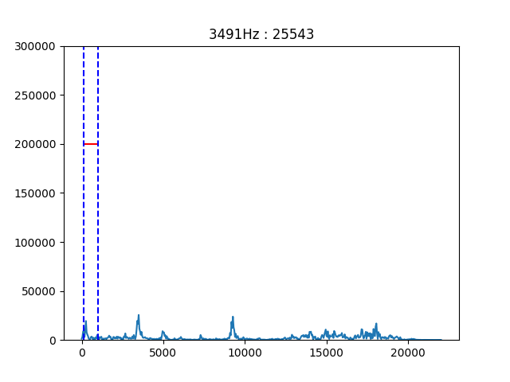

# Loud ditector
大声検知システム

## 動作環境
* macOS High Sierra
* python 3.9.9
* numpy==1.21.5
* matplotlib==3.5.1
* PyAudio==0.2.11
上記のOSおよびライブラリのバージョンにて動作を確認。  
その他の環境については動作未確認。  

## 動作方法
### サーバー側  
以下のコマンドで大声検知サーバーを起動。
```bash
python loud_detect_server.py
```
あるいは
```bash
python3 loud_detect_server.py
```

以下のようにクライアント接続待ちメッセージが表示される。  
```
waiting for connetcion...
```

### クライアント側
以下のコマンドでクライアントを起動。  
```bash
python client.py
```
あるいは
```bash
python3 clinet.py
```

## 機能
### サーバー - クライアント間通信
サーバーとクライアントはソケット通信を用いてメッセージを通訊します。   
ソケット通訊に用いるIPアドレスおよびポート番号はハードコーディングされているので、自信の環境に合わせて書き換えてください。  
```python
ip_address = '192.168.1.20'
port = 18888
```

サーバー側で大声を検知すると、クライアント側に ``Detect loud voice!`` という文字列を送信します。  

### 音声ログ保存機能
サーバー側で大声を検知すると、``audio_log`` ディレクトリに録音した音声ファイルを保存します。  
ディレクトリに保存できるファイル数は変数 ``AUDIO_LOG_MAX_NUM`` の数が上限です。  
既にディレクトリ内の音声ファイルが上限数存在する場合、古いファイルを削除して新規に音声ファイルを保存します。  

### スペクトル解析画面
サーバー側でキャプチャしている音声のスペクトル解析画面を表示します。  


横軸が周波数(0Hz〜22050Hz) で縦軸が各周波数のエネルギーを表します。  

青色の点線が検知したい周波数の範囲です。  
デフォルトは100Hzから1000Hzです(人間の声の周波数帯)。  
赤色の実践が大声検知の閾値です。  